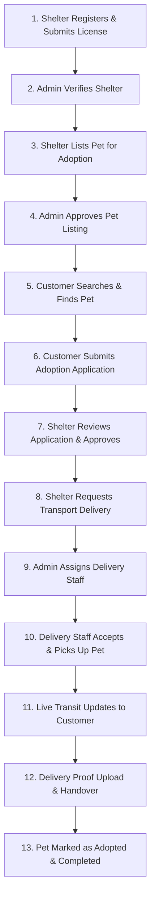

# Complete Pet Adoption Procedures & End-to-End Workflow Guide

This document provides a detailed breakdown of the complete **Pet Adoption Procedure** across all 4 platform roles (**Customer**, **Shelter**, **Admin**, and **Delivery Staff**).

---

---

## 📋 Phase 1: Shelter Onboarding & Pet Listing Approval

### Step 1.1: Shelter Account Registration
- **Actor**: Shelter Organization
- **Page**: [`/users/register/`](file:///c:/Users/HP/OneDrive/Desktop/PetADOPTION/users/templates/users/register.html)
- **Procedure**:
  1. Shelter registers an account selecting role **Shelter Admin**.
  2. Enters Shelter Name, Official License Number, Location, Contact Phone, and Shelter Bio.
  3. Status initialized as `Pending Verification ⏳`.

### Step 1.2: Admin Credentials Verification
- **Actor**: Admin Manager
- **Page**: [`/admin-dashboard/shelters/`](file:///c:/Users/HP/OneDrive/Desktop/PetADOPTION/pets/templates/pets/admin/shelters.html)
- **Procedure**:
  1. Admin inspects submitted shelter license number and physical location.
  2. Clicks **[Approve Registration]**.
  3. Shelter status changes to `Verified ✅`.

### Step 1.3: Pet Listing Creation
- **Actor**: Verified Shelter
- **Page**: [`/shelter-dashboard/add-pet/`](file:///c:/Users/HP/OneDrive/Desktop/PetADOPTION/pets/templates/pets/shelter/add_pet.html)
- **Procedure**:
  1. Shelter enters pet overview: Name, Species (Dog/Cat/Bird/Rabbit), Breed, Age, Gender, Weight, Location.
  2. Enters Medical History, Vaccination & Neutered status.
  3. Uploads high-res pet photos.
  4. Clicks **Submit for Approval**. Status: `Pending Admin Approval ⏳`.

### Step 1.4: Admin Pet Approval
- **Actor**: Admin Manager
- **Page**: [`/admin-dashboard/pets/`](file:///c:/Users/HP/OneDrive/Desktop/PetADOPTION/pets/templates/pets/admin/pets.html)
- **Procedure**:
  1. Admin reviews pet details and shelter/owner relationship mapping.
  2. Clicks **[Approve Pet]**.
  3. Pet status becomes `Available for Adoption 🐾` on public directory.

---

## 📋 Phase 2: Customer Discovery & Application

### Step 2.1: Pet Search & Filtering
- **Actor**: Customer / Adopter
- **Page**: [`/explore/`](file:///c:/Users/HP/OneDrive/Desktop/PetADOPTION/pets/templates/pets/pet_list.html) or [`/customer-dashboard/find-a-pet/`](file:///c:/Users/HP/OneDrive/Desktop/PetADOPTION/pets/templates/pets/customer/find_pet.html)
- **Procedure**:
  1. Customer uses multi-filters: Species, Breed, Age, Gender, Location, Vaccination.
  2. Can bookmark pet by clicking **❤️ Favorite** (saved to [`/customer-dashboard/favorites/`](file:///c:/Users/HP/OneDrive/Desktop/PetADOPTION/pets/templates/pets/customer/favorites.html)).

### Step 2.2: Pet Profile Inspection
- **Actor**: Customer
- **Page**: [`/pet/<id>/`](file:///c:/Users/HP/OneDrive/Desktop/PetADOPTION/pets/templates/pets/pet_detail.html)
- **Procedure**:
  1. Customer reviews photo gallery, age, size, medical records, shelter credentials, and adoption requirements.

### Step 2.3: Adoption Application Submission
- **Actor**: Customer
- **Page**: [`/adopt/<id>/`](file:///c:/Users/HP/OneDrive/Desktop/PetADOPTION/pets/templates/pets/adoption_form.html)
- **Procedure**:
  1. Customer fills out Full Name, Email, Phone, Housing Type (House/Apartment), Pet Experience, and Reason for Adoption.
  2. Clicks **Submit Adoption Application**.
  3. Request status initialized as `Pending Review ⏳`.

---

## 📋 Phase 3: Application Review & Approval

### Step 3.1: Shelter Application Screening
- **Actor**: Shelter Manager
- **Page**: [`/shelter-dashboard/requests/`](file:///c:/Users/HP/OneDrive/Desktop/PetADOPTION/pets/templates/pets/shelter/requests.html)
- **Procedure**:
  1. Shelter views incoming application details and applicant's housing suitability.
  2. Reviews applicant's message and past pet experience.

### Step 3.2: Application Approval & Transport Initiation
- **Actor**: Shelter Manager
- **Page**: [`/shelter-dashboard/requests/`](file:///c:/Users/HP/OneDrive/Desktop/PetADOPTION/pets/templates/pets/shelter/requests.html)
- **Procedure**:
  1. Shelter clicks **[Approve Application]**.
  2. Request status advances to `Approved ✅`. Pet status updates to `Pending Adoption`.
  3. If transport is needed, shelter clicks **[Create Delivery Request]** (`/shelter-dashboard/deliveries/`) specifying pickup shelter address, customer drop location, and preferred transport date.

---

## 📋 Phase 4: Delivery Dispatch & Staff Assignment

### Step 4.1: Delivery Staff Assignment
- **Actor**: Admin Dispatcher
- **Page**: [`/admin-dashboard/deliveries/`](file:///c:/Users/HP/OneDrive/Desktop/PetADOPTION/pets/templates/pets/admin/deliveries.html)
- **Procedure**:
  1. Admin views incoming transport requests.
  2. Selects available Delivery Staff member (e.g. John Driver) and assigns order `#DEL-1024`.

### Step 4.2: Delivery Acceptance
- **Actor**: Delivery Staff
- **Page**: [`/delivery-dashboard/`](file:///c:/Users/HP/OneDrive/Desktop/PetADOPTION/pets/templates/pets/delivery/dashboard.html)
- **Procedure**:
  1. Delivery staff inspects pickup shelter address, customer drop location, and pet info.
  2. Clicks **[Accept Delivery]**. Status updates to `Accepted`.

---

## 📋 Phase 5: Live Transport Tracking & Handover Audit Trail

### Step 5.1: Real-Time Milestone Status Updates
- **Actor**: Delivery Staff & Customer
- **Staff Page**: [`/delivery-dashboard/tracking/`](file:///c:/Users/HP/OneDrive/Desktop/PetADOPTION/pets/templates/pets/delivery/tracking.html)
- **Customer Page**: [`/customer-dashboard/delivery-tracking/`](file:///c:/Users/HP/OneDrive/Desktop/PetADOPTION/pets/templates/pets/customer/delivery_tracking.html)
- **Milestones**:
  1. `1. Adoption Approved ✅` (Completed)
  2. `2. Delivery Assigned ✅` (Completed)
  3. `3. Pet Picked Up from Shelter 🚚` (Driver updates when pet is secured)
  4. `4. In Transit 🚚` (Driver broadcasts active transit)
  5. `5. Arrived at Destination 📍` (Driver arrives at customer address)

### Step 5.2: Handover Confirmation & Photo Proof Upload
- **Actor**: Delivery Staff
- **Page**: [`/delivery-dashboard/confirmation/`](file:///c:/Users/HP/OneDrive/Desktop/PetADOPTION/pets/templates/pets/delivery/confirmation.html)
- **Procedure**:
  1. Delivery staff arrives at customer home, verifies recipient identity.
  2. Captures and uploads handover photo proof of pet with adopter.
  3. Clicks **[Complete Delivery]**.

### Step 5.3: Adoption Completion & Audit Finalization
- **System Outcome**:
  1. Adoption Request status updates to `Completed 🏁`.
  2. Pet status permanently updates to `Adopted 🐾`.
  3. Pet is officially added to Customer's **My Adopted Pets** gallery ([`/customer-dashboard/adopted-pets/`](file:///c:/Users/HP/OneDrive/Desktop/PetADOPTION/pets/templates/pets/customer/adopted_pets.html)).
  4. Payment transaction logged in Admin Financial Audit ([`/admin-dashboard/payments/`](file:///c:/Users/HP/OneDrive/Desktop/PetADOPTION/pets/templates/pets/admin/payments.html)).
